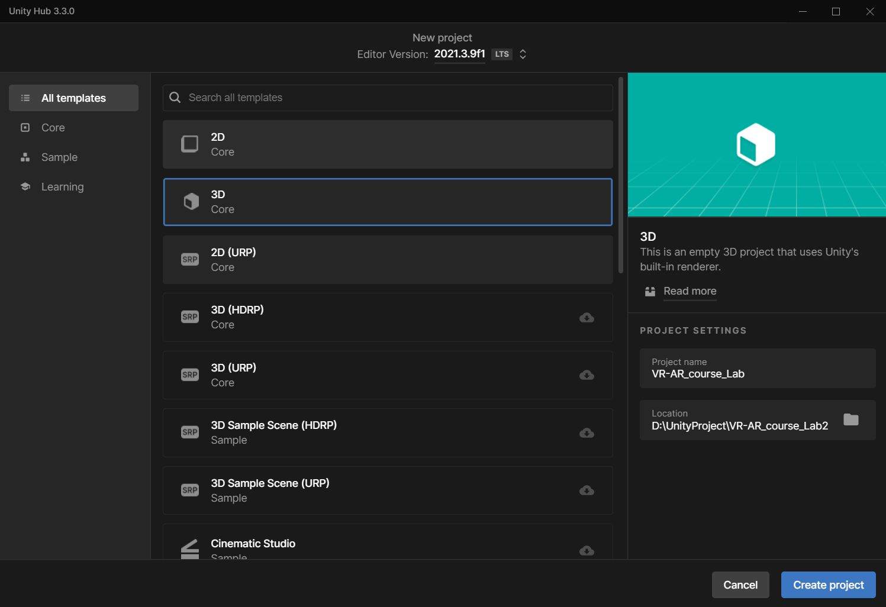
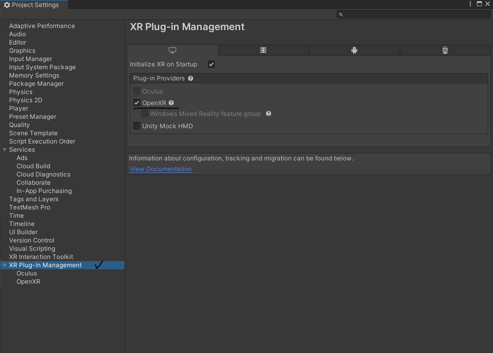
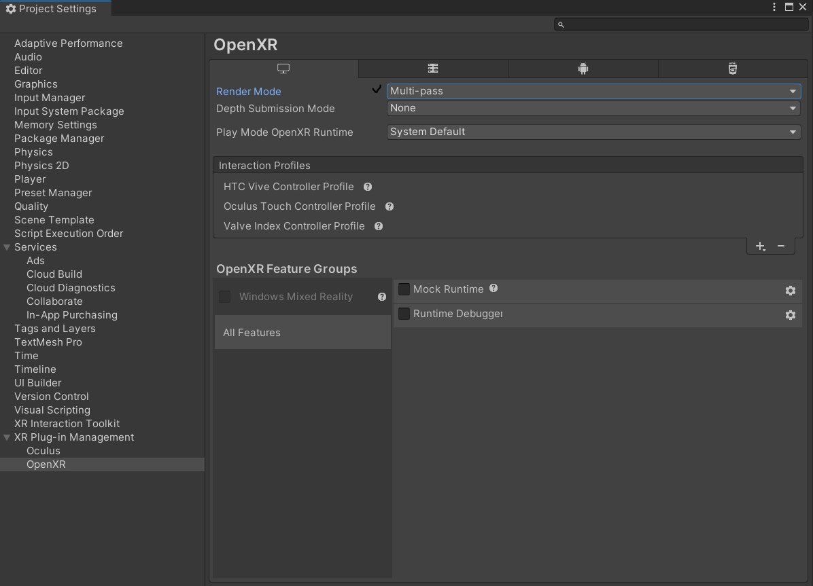
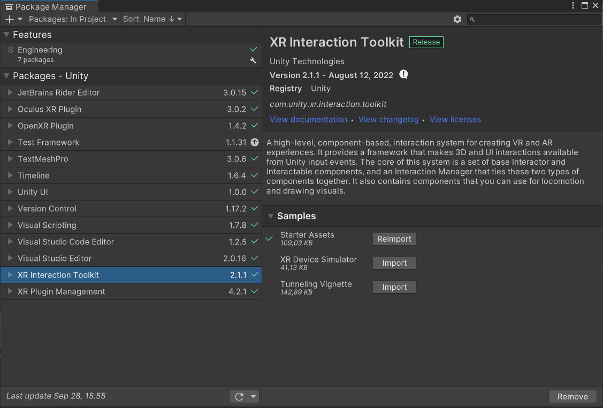
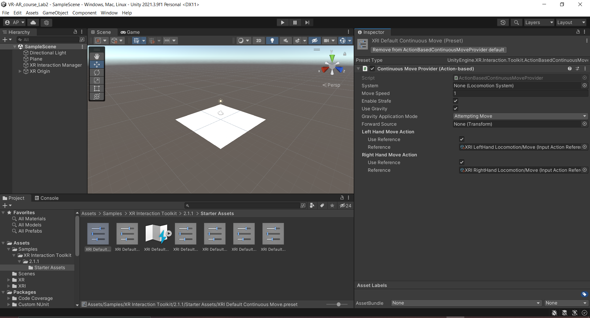
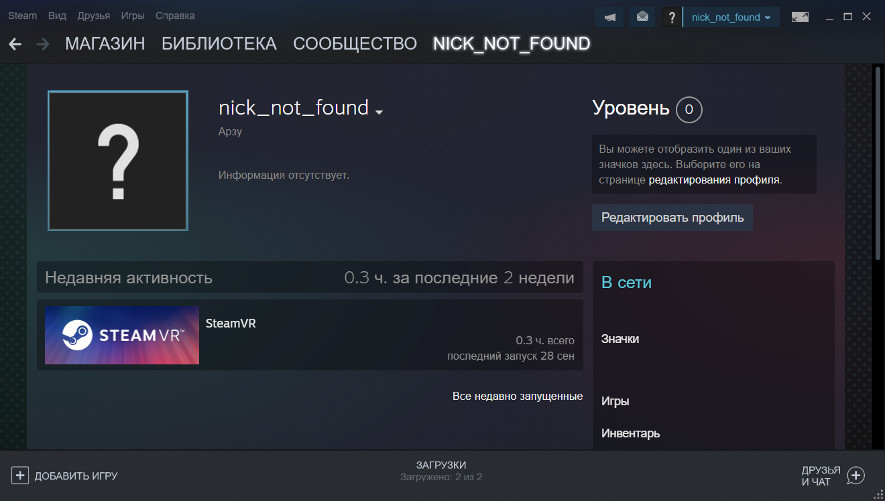
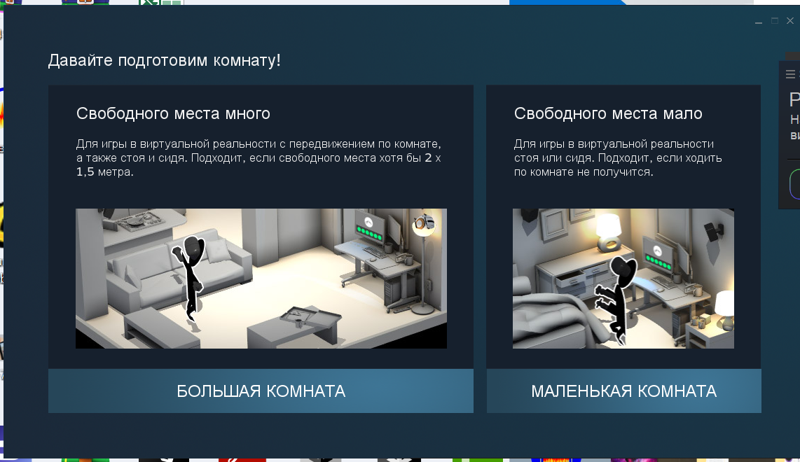
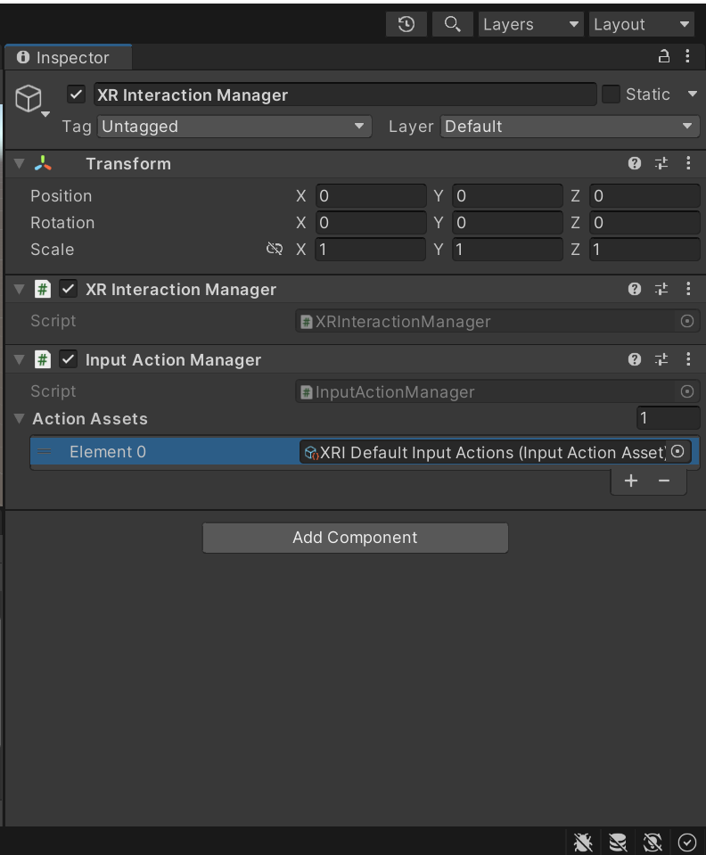

# Программные пакеты для работы с устройствами дополненной и виртуальной реальности. Возможности Unity XR в примерах.
Отчет по лабораторной работе #2 выполнила:
- Рзаева Арзу Масуд гызы
- РИ300012
Отметка о выполнении заданий:

| Задание | Выполнение |
| ------ | ------ |
| Задание 1 | * |
| Задание 2 | * |

знак "*" - задание выполнено; знак "#" - задание не выполнено;

Работу проверили:
- к.т.н., доцент Денисов Д.В.
- к.э.н., доцент Панов М.А.
- ст. преп., Фадеев В.О.

Структура отчета

- Данные о работе: название работы, фио, группа, выполненные задания.
- Цель работы.
- Задание 1.
- Код реализации выполнения задания. Визуализация результатов выполнения (если применимо).
- Задание 2.
- Код реализации выполнения задания. Визуализация результатов выполнения (если применимо).
- Выводы.
- ✨Magic ✨

## Цель работы
Изучить работу пакета Unity XR, настройку VR оборудования, запуск VR проекта через настроенное оборудование.

## Задание 1
### Пошагово выполнить каждый пункт раздела "ход работы" с описанием и примерами реализации задач
Ход работы:
1.	Создание нового Unity проекта из шаблона 3D-Core;

2.	Вкладка Edit -> Project settings;
3.	Установка XR Plugin Management;
4.	Настройка XR Plugin Management на работу через SDK OpenXR;

5.	Настройте режим рендера VR на каждый глаз;
6.	Добавить поддержку контроллеров вашего оборудования;

7.	Через вкладку Windows -> Pacage Manager добавила и установила пакет com.unity.xr.interaction.toolkit;
8.	Импорт Starter Assets из установленного пакета;

9.	Настройка Input system на основе импортированного Starter Assets (Добавила все компоненты из папки Starter Assets);

10.	Скачала и установила Steam и Steam VR;

11.	Настройте и подключите к PC ваше VR оборудование;

12.	Вернитесь в Unity и настройте запуск проекта через SteamVR;

13.	 Добавьте объект Plane;
14.	 Добавьте на сцену объект XR-Orig (Action Base);

15.	 На объект XR Interaction Manager создайте компонент Input Action Manager;
16.	 Добавьте в Input Action Manager настроенный Input System;

17.	 Запустите проект и убедитесь, что он воспроизводится на VR 
оборудовании.

## Задание 2
### Ответьте на контрольные вопросы:
1. Что значит X в аббревиатуре XR ?

Это общее сокращение, которое включет в себя AR - дополненную, VR - виртуальную и MR - смешанную реальности.

2. Какие SDK поддерживает XR Plugin Management по Default ?

Unity XR SDK:
- ARCore XR Plugin - для мобильных устройств под управлением Android 
- ARKit XR Plugin - для мобильных устройств под управлением IOS 
- Oculus XR Plugin
- Windows XR Plugin 
- Magic Leap Plugin
- VSP/3rd Party XR Plugin

XR Plugin Management по Default поддерживает:
- ARCore
- Oculus
- OpenXR
- Unity Mock HMD

## Выводы

Таким образом, в ходе лабораторной работы я изучила работу пакета Unity XR, настроила VR оборудовании, а также запустила свой VR проект через настроенное оборудование.

| Plugin | README |
| ------ | ------ |
| Dropbox | [plugins/dropbox/README.md][PlDb] |
| GitHub | [plugins/github/README.md][PlGh] |
| Google Drive | [plugins/googledrive/README.md][PlGd] |
| OneDrive | [plugins/onedrive/README.md][PlOd] |
| Medium | [plugins/medium/README.md][PlMe] |
| Google Analytics | [plugins/googleanalytics/README.md][PlGa] |